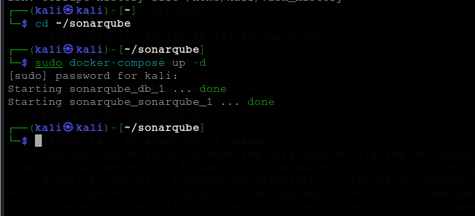
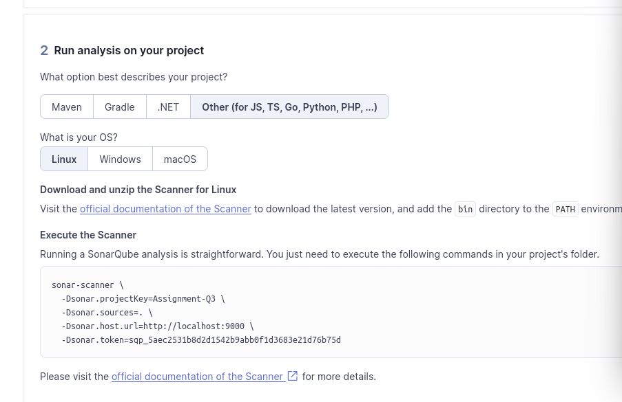
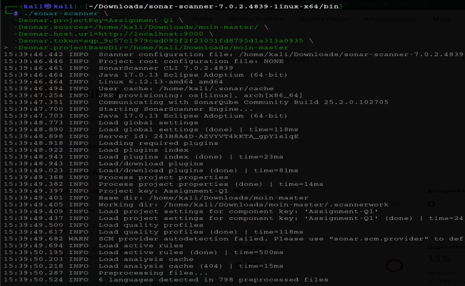

# Static Application Security Testing — MoinMaster and Hackazon

> **Module:** Cybersecurity for Software Development (B9CY104), Dublin Business School
> A comparison of two static analysis tools, SonarQube and Semgrep, run across two deliberately
> vulnerable web applications, assessing where the tools agree, where they diverge, and what that
> means for choosing between them.

---

## Overview

Static Application Security Testing examines source code and its dependencies without executing
anything. The objective is to find security defects **before deployment**, during the development
cycle, when fixes are cheapest.

This assessment scanned two applications with two tools and compared the results:

| Application | Stack | Description |
|-------------|-------|-------------|
| **MoinMaster** | Python | An advanced implementation of MoinMoin, a Python-based wiki engine |
| **Hackazon** | PHP | A deliberately vulnerable e-commerce application built for security training |

| Tool | Character |
|------|-----------|
| **SonarQube** | Server-based platform. Deep analysis across 27+ languages, presenting bugs, vulnerabilities and code smells through a dashboard with an overall security rating. Classifies by severity (Blocker, Critical, Major, Minor, Info) and by type. |
| **Semgrep** | Lightweight pattern-matching scanner supporting 30+ languages, with custom rules in YAML. Fast enough to sit in a pipeline. |

---

## Results

**MoinMaster, SonarQube**

| Metric | Value |
|--------|-------|
| Bugs | 11 |
| Vulnerabilities | 13 |
| Code smells | 148 |
| Security rating | **E** (worst available) |

**Hackazon, SonarQube**

| Metric | Value |
|--------|-------|
| Bugs | 204 |
| Vulnerabilities | 121 |
| Code smells | 2,062 |
| Reliability and security rating | **D** |

**Semgrep, both applications**

Surfaced unvalidated file inclusion, potential SQL injection, insecure validation practices and
inadequate input sanitisation on MoinMaster; and SQL injection, cross-site scripting, insecure
authentication management, weak access controls and insecure session management on Hackazon.

Hackazon also contained hardcoded credentials directly in source, for example a database
connection instantiated with a literal username and password.

---

## Comparative analysis

**Where the tools agreed.** Both independently identified the serious issues: SQL injection where
user input reaches a query without parameterisation, cross-site scripting where input is rendered
into HTML without sanitisation, and missing authorisation checks before access to sensitive
functionality. Agreement between two independent tools is a strong signal that a finding is real.

**Where SonarQube went further.** It reported well beyond security into maintainability, flagging
substantial technical debt, overly complex methods, duplicated blocks, ineffective exception
handling, and resource management problems such as database connections and file handles left
open. Those are not vulnerabilities in themselves, but code that is hard to maintain is code
where security fixes are applied inconsistently.

**Where Semgrep went further.** Speed and pipeline fit. It requires no server, runs quickly, and
custom rules are straightforward to write, which makes it far easier to run on every commit.

**The conclusion.** These tools are not substitutes for one another. SonarQube suits a scheduled,
in-depth quality and security review; Semgrep suits continuous checking inside CI. A finding
count is also not an achievement. Over two thousand code smells on Hackazon is a triage problem,
and the analyst's job is to separate what matters from what merely registers.

---

## Limitations, stated honestly

This assessment is static only. No dynamic testing was performed here, so runtime-only issues
were out of scope by design. For the dynamic side of the same syllabus, see the companion
assessment of OWASP WebGoat using Snyk and OWASP ZAP, which found an almost entirely different
set of issues and makes the argument for running both.

Both applications are intentionally vulnerable training targets, so a high finding count is the
expected outcome rather than a discovery.

---

## Screenshots

Selected screenshots captured during the assessment. The full walkthrough with every screenshot is in the report under `docs/`.

*The remaining 4 screenshots are in the `screenshots/` folder.*

---

## Repository contents

- `docs/` — the full report, including tool setup, per-application findings, comparative
  analysis, false positive discussion, and scan output appendices
